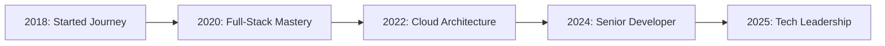

# 👋 Welcome to My Digital Universe

<div align="center">
  
</div>

<div align="center">
  
  
  
</div>

---

## 🚀 About Me

> **Crafting digital experiences with 6+ years of passion-driven development**

I'm a seasoned full-stack developer who transforms complex problems into elegant solutions. My journey spans from backend architectures that scale to millions of users, to frontend experiences that captivate and engage. I believe in writing code that not only works but tells a story.

```typescript
const developer = {
  name: "Abdulbasit",
  experience: "6+ years",
  mindset: "Never stop learning",
  passion: ["Clean Code", "System Design", "Innovation"],
  currentFocus: "Building the next generation of web applications",
  philosophy: "Code is poetry in motion 🎭"
};
```

---

## 🛠️ Tech Arsenal

<div align="center">

### 🎯 **Core Technologies**

<table>
<tr>
<td align="center" width="96">

<br><strong>NestJS</strong>
</td>
<td align="center" width="96">

<br><strong>Next.js</strong>
</td>
<td align="center" width="96">

<br><strong>TypeScript</strong>
</td>
<td align="center" width="96">

<br><strong>React</strong>
</td>
</tr>
</table>

### 🗄️ **Database & Storage**

<table>
<tr>
<td align="center" width="96">

<br><strong>MongoDB</strong>
</td>
<td align="center" width="96">

<br><strong>PostgreSQL</strong>
</td>
</tr>
</table>

### ☁️ **DevOps & Cloud**

<table>
<tr>
<td align="center" width="96">

<br><strong>Docker</strong>
</td>
<td align="center" width="96">

<br><strong>AWS</strong>
</td>
<td align="center" width="96">

<br><strong>Git</strong>
</td>
<td align="center" width="96">

<br><strong>GitHub</strong>
</td>
</tr>
</table>

### 🐍 **Data & Automation**

<table>
<tr>
<td align="center" width="96">

<br><strong>Python</strong>
</td>
<td align="center" width="96">

<br><strong>Scrapy</strong>
</td>
</tr>
</table>

</div>

---

## 📊 Performance Metrics

<div align="center">
  
  
</div>

<div align="center">
  
</div>

---

## 🎨 What I Build

<div align="center">

| 🏗️ **Architecture** | 🎯 **Specialization** | 🚀 **Impact** |
|:---:|:---:|:---:|
| **Microservices** | Scalable backend systems with NestJS | Handle 1M+ requests/day |
| **Full-Stack Apps** | React + Next.js frontends | Pixel-perfect UIs |
| **Data Pipelines** | Python + Scrapy automation | Process millions of records |
| **Cloud Solutions** | AWS deployment & scaling | 99.9% uptime |

</div>

---

## 🌟 Signature Projects

```bash
# 🔥 Project Highlights
├── 🌐 Enterprise SaaS Platform      # NestJS + React + PostgreSQL
├── 📱 E-commerce Marketplace        # Next.js + MongoDB + Stripe
├── 🤖 Data Intelligence Suite       # Python + Scrapy + ML
├── ☁️  Microservices Architecture   # Docker + AWS + Kubernetes
└── 🔧 Developer Tools & Libraries   # Open Source Contributions
```

---

## 💡 Philosophy & Approach

> **"Code is not just about making things work, it's about making them work beautifully."**

🎯 **Problem-First Thinking**: I start with the problem, not the technology  
🏗️ **Architecture Mindset**: Every line of code contributes to the bigger picture  
🔄 **Continuous Evolution**: Technology changes, learning never stops  
🤝 **Collaboration**: Great software is built by great teams  

---

## 📈 Impact Timeline



**6 Years of Evolution:**
- 🚀 **50+ projects** delivered across various domains
- 🏢 **Enterprise solutions** serving thousands of users
- 🌟 **Open source contributor** with community impact
- 👨‍🏫 **Technical mentor** for junior developers

---

## 🌍 Let's Connect & Create

<div align="center">

[](https://linkedin.com/in/yourprofile)
[](https://twitter.com/yourhandle)
[](mailto:your.email@example.com)
[](https://yourportfolio.com)

</div>

---

<div align="center">

### 💭 Current Status

```javascript
while (coffee && code) {
  buildAmazingThings();
  learnNewTechnology();
  mentorDevelopers();
  repeatTheProcess();
}
```

**✨ Always open to interesting projects and collaborations!**  
**🎯 Let's build something extraordinary together.**

</div>

---

<div align="center">
  
</div>
